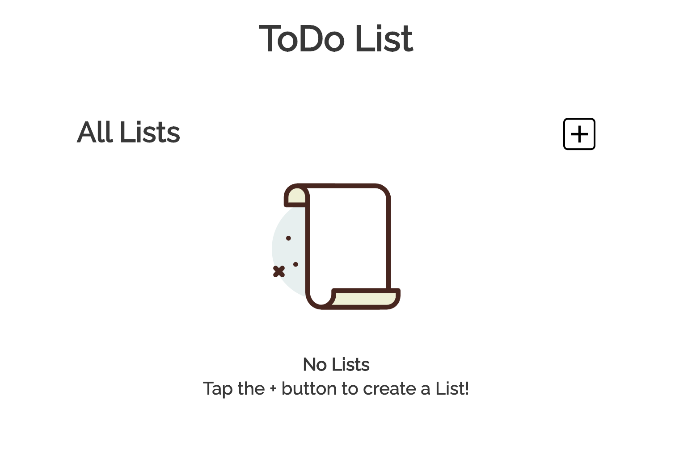
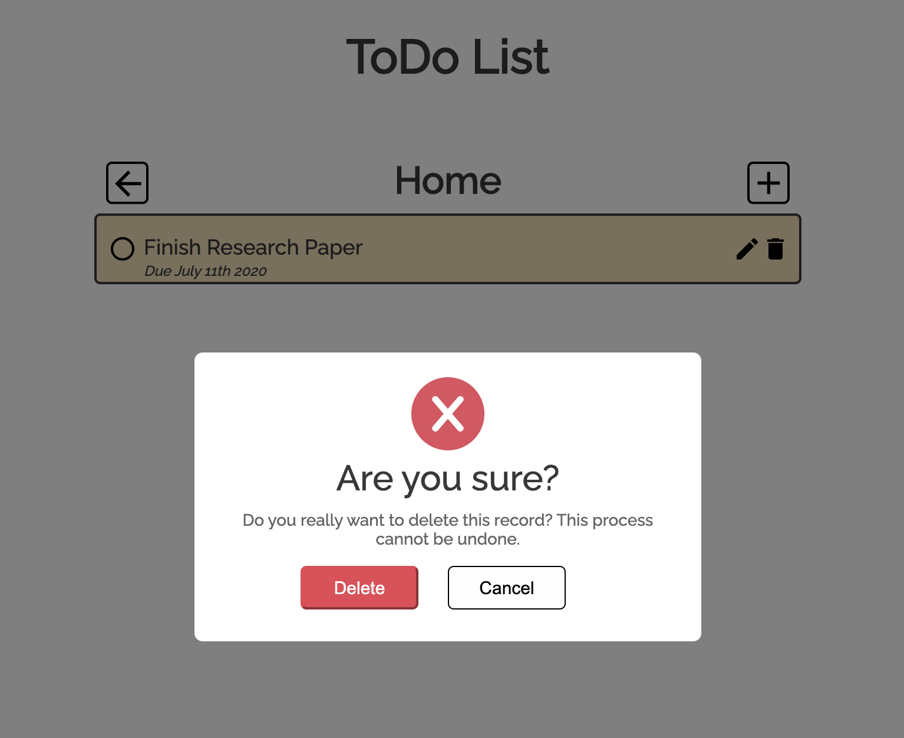

# Todo List

This is a Todo List Application that is dynamically rendered through JavaScript DOM Manipulation.

> **Home page**

# 

## Table of contents

1. [Demo](#demo)
2. [Technologies](#technologies)
3. [Features](#features)
4. [Development](#development)

## Demo

Here is the working live demo:
[https://justinkar.github.io/todo-list/](https://justinkar.github.io/todo-list/).

## Technologies

- JavaScript (ES6)
- Webpack
- NPM (Node Package Manager)
- Date-Fns Library
- The Web Storage API (localStorage)

## Features

- Add a Todo List
- Create Custom tasks within a list
- Displays Tasks with their Due Date in MM/DD/YYYY format
- Mark ToDos as completed
- Edit ToDos
- Delete ToDos
- Saved to localStorage

> **_Todo Delete modal_**

# 

## Development

To set up this App locally, clone this repo to your desktop and run `npm install` to install all the dependencies. Then `npm start` to launch the App.
